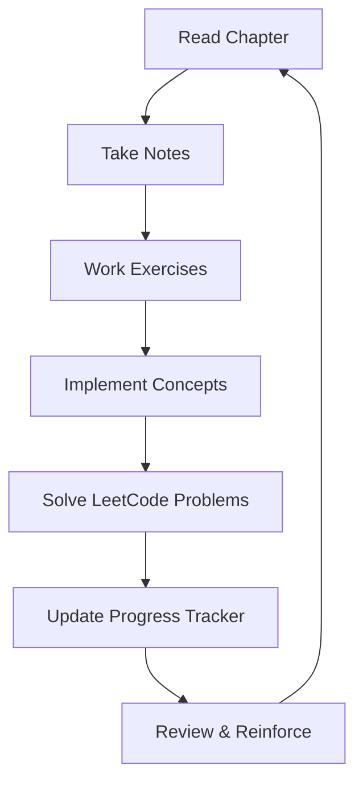

# Discrete Mathematics for Programming - Repository Structure

This repository is organized to help you master discrete mathematics concepts while directly applying them to programming and LeetCode problems.

## 📁 Repository Structure

```
discrete-math-study/
├── README.md                           # This file
├── progress-tracker.md                 # Overall progress and goals
├── leetcode-connections.md             # Maps concepts to LeetCode problems
├── 
├── 📁 chapters/                        # Chapter-by-chapter content
│   ├── chapter-01-logic-proofs/
│   │   ├── notes.md                    # Chapter notes
│   │   ├── key-concepts.md             # Summary of key concepts
│   │   ├── exercises/                  # Textbook exercises
│   │   │   ├── section-1-1.md
│   │   │   ├── section-1-2.md
│   │   │   └── solutions/
│   │   ├── programming-applications/   # Code implementations
│   │   │   ├── boolean-logic.py
│   │   │   ├── truth-tables.py
│   │   │   └── proof-validation.py
│   │   └── leetcode-practice/         # Related LeetCode problems
│   │       ├── problems-list.md
│   │       └── solutions/
│   │
│   ├── chapter-02-sets-functions/
│   ├── chapter-03-algorithms/
│   ├── chapter-04-number-theory/
│   ├── chapter-05-induction-recursion/
│   ├── chapter-06-counting/
│   ├── chapter-07-probability/
│   ├── chapter-08-advanced-counting/
│   ├── chapter-09-relations/
│   ├── chapter-10-graphs/
│   ├── chapter-11-trees/
│   ├── chapter-12-boolean-algebra/
│   └── chapter-13-complexity/
│
├── 📁 implementations/                 # Code implementations by topic
│   ├── data-structures/
│   │   ├── sets.py
│   │   ├── graphs.py
│   │   ├── trees.py
│   │   └── hash-tables.py
│   ├── algorithms/
│   │   ├── sorting/
│   │   ├── searching/
│   │   ├── graph-algorithms/
│   │   └── dynamic-programming/
│   └── mathematical-concepts/
│       ├── combinatorics.py
│       ├── probability.py
│       └── number-theory.py
│
├── 📁 leetcode-by-concept/            # LeetCode problems organized by concept
│   ├── logic-and-boolean/
│   ├── set-operations/
│   ├── recursion-induction/
│   ├── combinatorics/
│   ├── graph-theory/
│   ├── tree-algorithms/
│   └── complexity-analysis/
│
├── 📁 templates/                      # Templates for consistent note-taking
│   ├── chapter-template.md
│   ├── exercise-template.md
│   └── leetcode-solution-template.md
│
├── 📁 references/                     # Quick reference materials
│   ├── formulas-cheatsheet.md
│   ├── big-o-reference.md
│   ├── proof-techniques.md
│   └── common-patterns.md
│
└── 📁 projects/                       # Larger programming projects
    ├── graph-visualizer/
    ├── algorithm-complexity-analyzer/
    └── discrete-math-calculator/
```

## 🎯 How to Use This Structure

### 1. **Start with a Chapter**
- Read the textbook chapter
- Take notes in `chapters/chapter-XX/notes.md`
- Summarize key concepts in `key-concepts.md`

### 2. **Work Through Exercises**
- Solve textbook exercises in the `exercises/` folder
- Create solutions with explanations
- Focus on proof techniques and logical reasoning

### 3. **Connect to Programming**
- Implement concepts in the `programming-applications/` folder
- Write clean, documented code that demonstrates the mathematical concepts
- Focus on how the math translates to efficient algorithms

### 4. **Practice with LeetCode**
- Check `leetcode-connections.md` for relevant problems
- Solve problems and document your approach
- Store solutions in the appropriate concept folders

### 5. **Build Projects**
- Apply multiple concepts in larger projects
- Create visualizations and tools that reinforce learning
- Document your learning process

## 🔗 Study Workflow



## 📈 Progress Tracking

Use the `progress-tracker.md` file to:
- Set weekly goals
- Track completed chapters and exercises
- Note LeetCode problems solved
- Reflect on what you've learned
- Identify areas needing more practice

## 💡 Programming Focus Areas

Each chapter will emphasize:
- **Algorithm Implementation**: How concepts translate to code
- **Complexity Analysis**: Big O notation and efficiency
- **Data Structure Applications**: When and why to use specific structures
- **Problem-Solving Patterns**: Recognizing when to apply discrete math concepts
- **Code Optimization**: Using mathematical insights to improve performance

## 🎯 LeetCode Integration

The repository maps discrete math concepts to relevant LeetCode problems:
- **Logic & Proofs** → Boolean logic problems, validation algorithms
- **Set Theory** → Array operations, unique elements, intersections
- **Graph Theory** → Graph traversal, shortest paths, connectivity
- **Combinatorics** → Permutations, combinations, dynamic programming
- **Number Theory** → Mathematical problems, GCD/LCM, modular arithmetic

This structure ensures that every mathematical concept you learn has direct applications to the types of problems you'll encounter in technical interviews and competitive programming.
